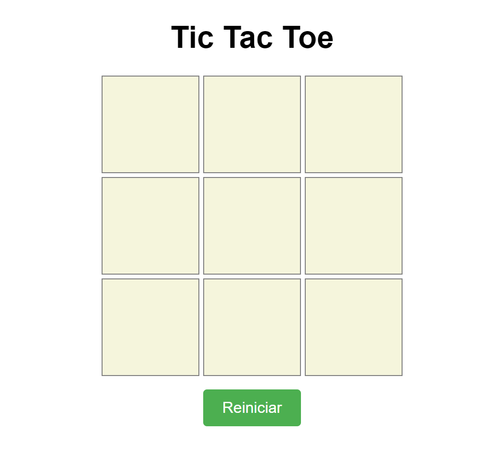
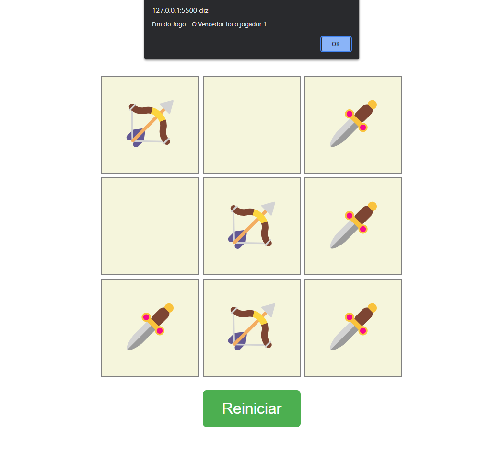

# Jogo da velha

Este é um projeto de um jogo da velha feito em JavaScript. O game é jogado em um tabuleiro 3x3, onde o objetivo é formar uma linha, coluna ou diagonal com três símbolos iguais. O jogo termina quando um jogador vence ou quando não há mais células vazias.

 
